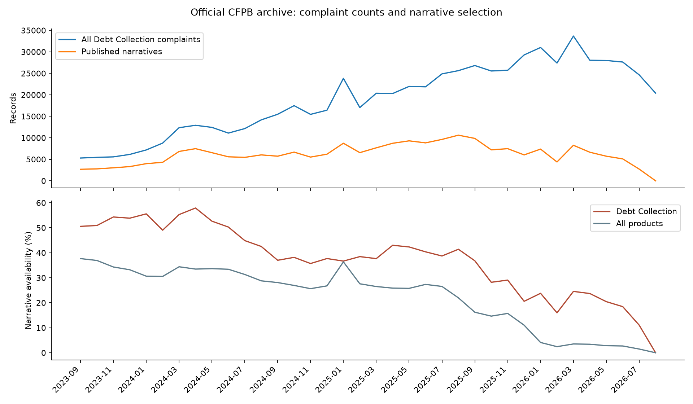
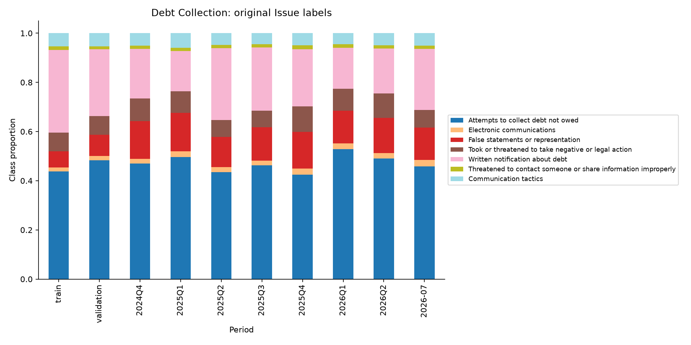
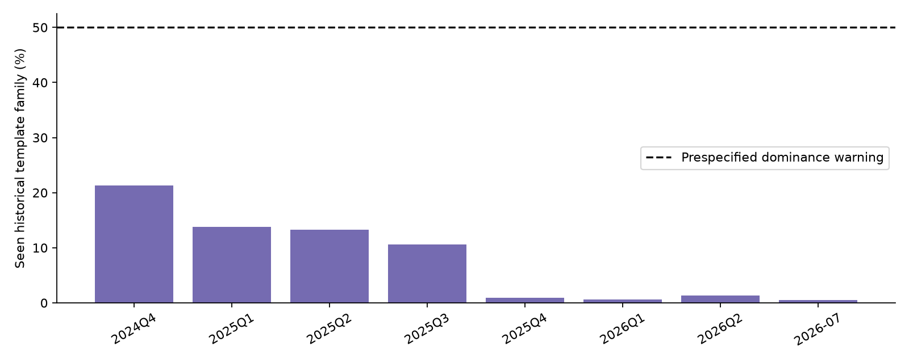
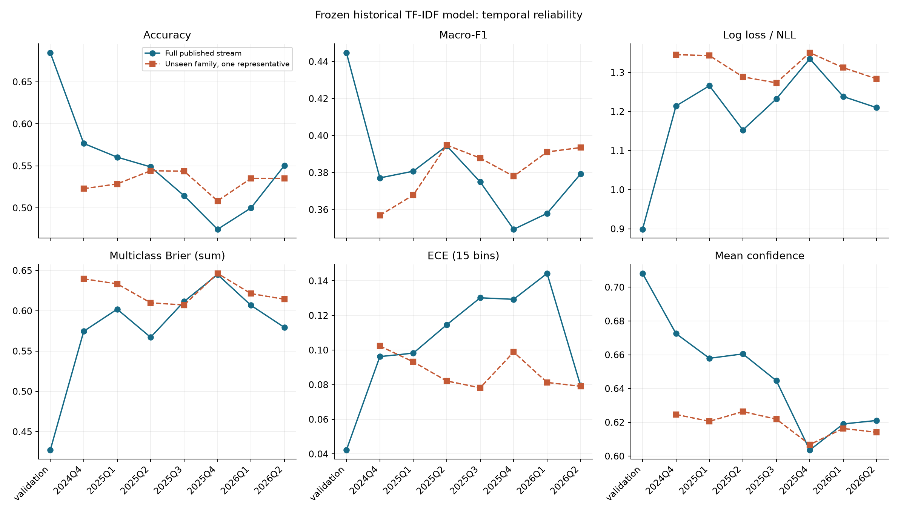
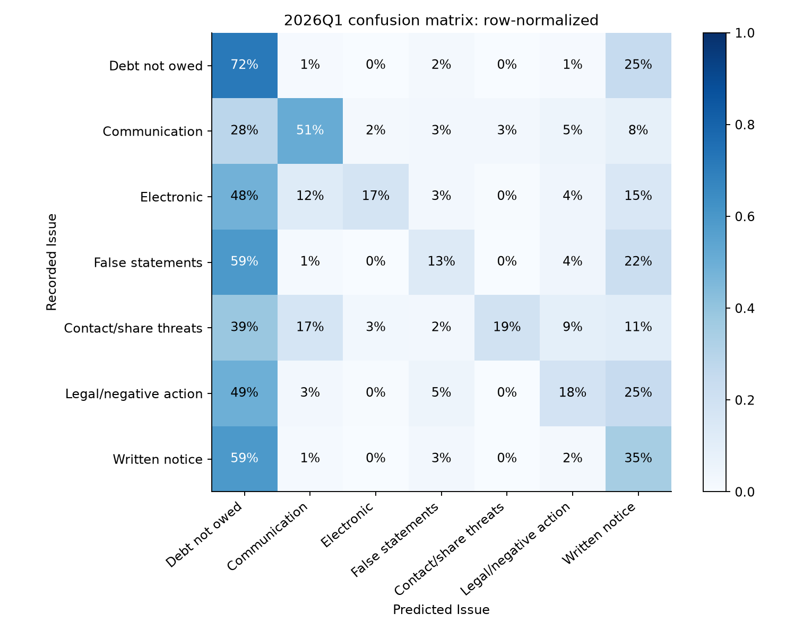
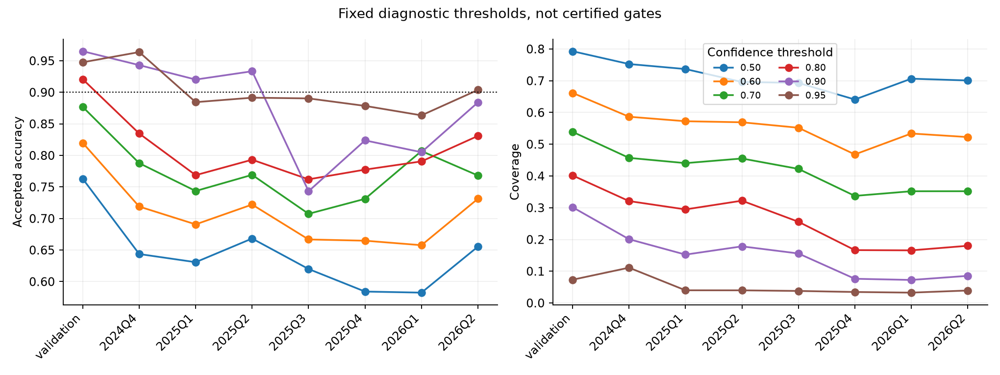
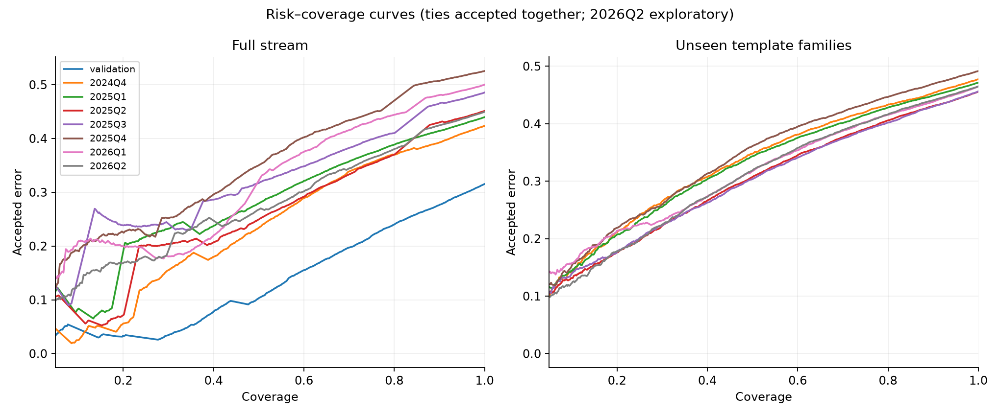
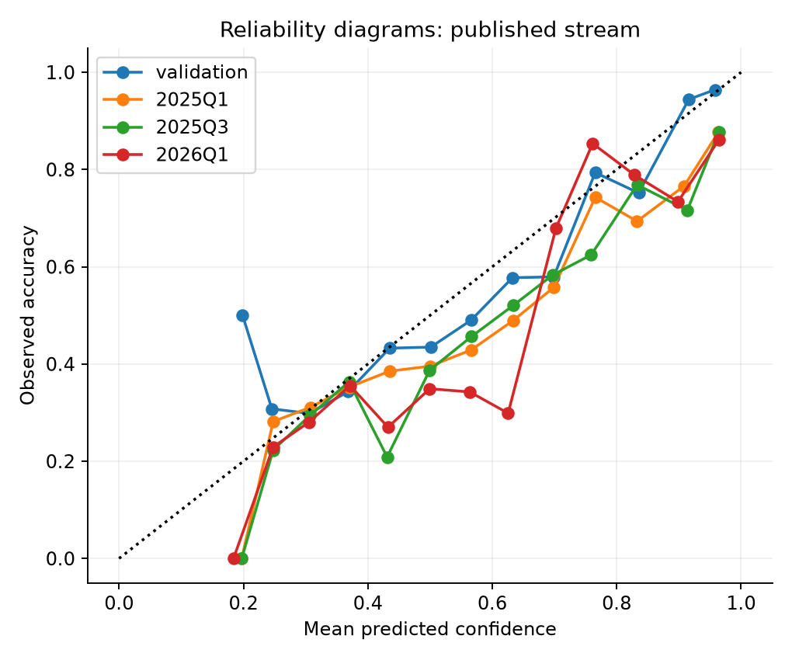

# Debt Collection → Issue: CPU feasibility pilot

**Decision: GO (4/4 fixed conditions).** No Laya or ModernBERT was trained. No GPU was used. This is task feasibility, not evidence that a TDM will help.

## 1. Provenance and authenticity

Downloaded 17 official CFPB archive ZIPs directly from the [official narrative archive](https://www.consumerfinance.gov/foia-requests/foia-electronic-reading-room/cfpb-consumer-complaint-database-narratives-archive/), plus its landing page and the [August 2023 taxonomy](https://files.consumerfinance.gov/f/documents/cfpb_consumer_complaint_form_product_issue_options_August_2023_FINAL.pdf). `data/source_manifest.json` records exact URLs, download UTC timestamps, sizes and SHA256. No Kaggle/third-party cleaned data.

These are authentic administrative records; this does not establish that each allegation is correct or each narrative is human-authored. Product/Issue are administrative/consumer-selected labels, not expert-adjudicated semantic ground truth. Published complaints are not representative of all consumers. See [CFPB database guidance](https://www.consumerfinance.gov/data-research/consumer-complaints/).

## 2. Actual usable range and cohort sizes

Across September 2023–August 2026: **13,495,502 records**, **222,885 Debt Collection narratives**. Duplicate Complaint IDs: 0; invalid dates: 0. All 7 labels qualify from training alone; all persist later. There are 46,493 raw training narratives and 34,343 after retaining the earliest exact-text occurrence. The five primary future quarters contain **120,624 narratives**.

Primary future horizon: 2025Q1–2026Q1. Q4 2024 is an initial later test. Q2 2026 passed the frozen availability heuristic and is **exploratory**, not proof of complete/unbiased publication. July failed the adequacy/availability rule and was not modeled. August has no Debt Collection narratives and was not modeled.

| quarter | total_records | nonempty_narratives | debt_records | debt_narratives | debt_narrative_fraction |
|---|---|---|---|---|---|
| 2023Q3 | 112887 | 42517 | 5298 | 2679 | 0.506 |
| 2023Q4 | 353851 | 123094 | 17153 | 9101 | 0.531 |
| 2024Q1 | 478794 | 153193 | 28301 | 15116 | 0.534 |
| 2024Q2 | 607249 | 203483 | 36437 | 19597 | 0.538 |
| 2024Q3 | 761291 | 223109 | 41795 | 17201 | 0.412 |
| 2024Q4 | 886935 | 234600 | 49361 | 18377 | 0.372 |
| 2025Q1 | 1207992 | 370569 | 61231 | 22959 | 0.375 |
| 2025Q2 | 1233443 | 324615 | 64123 | 26848 | 0.419 |
| 2025Q3 | 1472611 | 316064 | 77314 | 30102 | 0.389 |
| 2025Q4 | 1528918 | 210802 | 80536 | 20700 | 0.257 |
| 2026Q1 | 1653328 | 55991 | 92081 | 20015 | 0.217 |
| 2026Q2 | 1859027 | 55400 | 83657 | 17463 | 0.209 |
| 2026Q3 | 1339176 | 10003 | 45047 | 2727 | 0.061 |

2023Q3 here contains September only; 2026Q3 contains July/August only. Monthly and daily CSVs preserve exact coverage. July official export: 672,036 records / 10,002 narratives. August: 667,140 records / 1 narrative, zero Debt Collection. These independently reproduce the earlier warning.

The Debt Collection narrative fraction falls from roughly 53% in early 2024 to 22% in 2026Q1. Therefore observed changes cannot be attributed solely to consumer-language/concept drift. June process changes and August publication cessation are additional context: [June CFPB notice](https://www.consumerfinance.gov/about-us/newsroom/the-cfpb-is-correcting-flaws-to-restore-integrity-and-utility-to-the-consumer-complaint-system/), [August CFPB notice](https://www.consumerfinance.gov/about-us/newsroom/the-cfpb-to-cease-discretionary-publication-of-complaint-narratives-and-visualizations/).

## 3. Stable classes and imbalance

| Issue | Training n | Training percent |
|---|---|---|
| Attempts to collect debt not owed | 20389 | 43.85 |
| Communication tactics | 2522 | 5.42 |
| Electronic communications | 724 | 1.56 |
| False statements or representation | 3047 | 6.55 |
| Threatened to contact someone or share information improperly | 617 | 1.33 |
| Took or threatened to take negative or legal action | 3530 | 7.59 |
| Written notification about debt | 15664 | 33.69 |

No new/disappeared original label strings occur among observed Debt Collection narratives in modeled periods. No renaming was inferred or labels merged. Stable strings do not prove stable annotation behavior. `configs/debt_collection_issues.yaml` contains inclusion decisions, original labels, training and all future counts. `debt_issue_proportions.csv` and `label_prior_drift.csv` document prior changes. Training entropy and period-specific character/word distributions are in `debt_period_summary.csv`.

## 4. Duplication, templates and leakage

222,885 rows yield 167,154 raw exact unique texts and 149,793 conservative lexical families. There are 10,977 repeated families, 1,120 spanning periods, and 49,594 rows belonging to cross-period families. Exactly identical texts have conflicting Issue labels in 229 groups; 767 broader template families contain multiple labels. That is evidence of ambiguity/dependence, not proof every conflicting label is wrong.

Method: 128-permutation MinHash on normalized word 5-shingles, LSH candidate threshold .70, exact Jaccard >=.85 confirmation, transitive union-find families. Number/redaction normalization is for deduplication only. Short texts still undergo exact/canonical checks. No exhaustive semantic-paraphrase search or consumer identity linkage was performed; missed paraphrases remain possible.

| period | n | families | seen_historical_fraction | novel_families | largest_family |
|---|---|---|---|---|---|
| train | 46493 | 30642 | 1.000 | 0 | 1515 |
| validation | 17201 | 11038 | 1.000 | 0 | 1210 |
| 2024Q4 | 18377 | 12476 | 0.213 | 12317 | 1205 |
| 2025Q1 | 22959 | 17172 | 0.138 | 17063 | 878 |
| 2025Q2 | 26848 | 17113 | 0.133 | 17034 | 2039 |
| 2025Q3 | 30102 | 20022 | 0.106 | 19964 | 2120 |
| 2025Q4 | 20700 | 15199 | 0.010 | 15164 | 1487 |
| 2026Q1 | 20015 | 13452 | 0.006 | 13428 | 1306 |
| 2026Q2 | 17463 | 12471 | 0.013 | 12441 | 675 |
| 2026-07 | 2727 | 2038 | 0.006 | 2029 | 228 |

Training/validation exposure is 100% by definition in that column; it is not a claim that validation wholly duplicates training. The cross-period column in the full CSV shows that distinction. Training exact duplicates are removed. Future operational results retain repeats, while novel-family results remove historical families and keep one representative per period. Templates can inflate or depress accuracy depending on their label distribution, not only inflate it.

## 5. Lightweight model and chronological results

Word unigram/bigram TF-IDF, max 100,000 features, min_df=3, sublinear TF, multinomial logistic regression. Only narrative strings enter the vectorizer. Train September 2023–June 2024; select among C=0.3/1/3 on July–September 2024 macro-F1. Selected C=3.0. Vocabulary is fitted only on exact-deduplicated training texts. No random split and no calibration fitting. Models are frozen for future evaluation.

| period | n | accuracy | macro_f1 | balanced_accuracy | nll | brier | ece | mean_confidence | confidence_minus_accuracy |
|---|---|---|---|---|---|---|---|---|---|
| validation | 17201 | 0.685 | 0.445 | 0.406 | 0.899 | 0.427 | 0.042 | 0.708 | 0.024 |
| 2024Q4 | 18377 | 0.577 | 0.377 | 0.357 | 1.214 | 0.575 | 0.096 | 0.673 | 0.096 |
| 2025Q1 | 22959 | 0.560 | 0.381 | 0.355 | 1.266 | 0.602 | 0.098 | 0.658 | 0.098 |
| 2025Q2 | 26848 | 0.549 | 0.394 | 0.359 | 1.153 | 0.567 | 0.115 | 0.661 | 0.112 |
| 2025Q3 | 30102 | 0.514 | 0.375 | 0.338 | 1.232 | 0.611 | 0.130 | 0.645 | 0.130 |
| 2025Q4 | 20700 | 0.474 | 0.349 | 0.321 | 1.335 | 0.645 | 0.129 | 0.604 | 0.129 |
| 2026Q1 | 20015 | 0.500 | 0.358 | 0.322 | 1.238 | 0.607 | 0.144 | 0.619 | 0.119 |
| 2026Q2 | 17463 | 0.550 | 0.379 | 0.341 | 1.210 | 0.579 | 0.079 | 0.621 | 0.071 |

Brier is the sum over classes (range 0–2); ECE uses 15 fixed equal-width bins. Mean confidence is maximum class probability. Full CSVs contain every requested per-class precision/recall/F1, confusion matrix and probability metric for every evaluated period and variant. Convergence/tuning records are in `outputs/tables/historical_tuning.csv`.

| period | accuracy_full | macro_f1_full | accuracy_novel | macro_f1_novel |
|---|---|---|---|---|
| 2024Q4 | 0.577 | 0.377 | 0.523 | 0.357 |
| 2025Q1 | 0.560 | 0.381 | 0.529 | 0.368 |
| 2025Q2 | 0.549 | 0.394 | 0.544 | 0.395 |
| 2025Q3 | 0.514 | 0.375 | 0.544 | 0.388 |
| 2025Q4 | 0.474 | 0.349 | 0.508 | 0.378 |
| 2026Q1 | 0.500 | 0.358 | 0.535 | 0.391 |
| 2026Q2 | 0.550 | 0.379 | 0.535 | 0.394 |

The task is far from near-perfect. The full stream and novel-family populations differ materially; neither should replace the other without explanation. Among the five primary future quarters, novel-family accuracy stays approximately 51–54%, much more stable than full-stream accuracy. Therefore the large full-stream decline is not evidence of pure semantic drift; repetitions and sample composition materially affect it. The model is a weak lexical baseline, so difficulty may reflect ambiguous administrative labels as well as limited model capacity. The baseline does not prove that a stronger model will solve the target reliably.

Majority-class baseline:

| period | accuracy | macro_f1 |
|---|---|---|
| validation | 0.484 | 0.093 |
| 2024Q4 | 0.471 | 0.091 |
| 2025Q1 | 0.496 | 0.095 |
| 2025Q2 | 0.435 | 0.087 |
| 2025Q3 | 0.462 | 0.090 |
| 2025Q4 | 0.424 | 0.085 |
| 2026Q1 | 0.528 | 0.099 |
| 2026Q2 | 0.491 | 0.094 |

In 2026Q1, TF-IDF accuracy is below the majority baseline (about 50.0% versus 52.8%), although TF-IDF macro-F1 is substantially higher. A non-trivial task is not automatically a good high-accuracy automation task.

## 6. Class confusion and lexical difficulty

2026Q1 per-class results:

| issue | precision | recall | f1 | support |
|---|---|---|---|---|
| Attempts to collect debt not owed | 0.601 | 0.716 | 0.653 | 10576 |
| Communication tactics | 0.582 | 0.512 | 0.544 | 897 |
| Electronic communications | 0.577 | 0.173 | 0.266 | 474 |
| False statements or representation | 0.470 | 0.132 | 0.206 | 2665 |
| Threatened to contact someone or share information improperly | 0.640 | 0.190 | 0.293 | 290 |
| Took or threatened to take negative or legal action | 0.477 | 0.181 | 0.263 | 1767 |
| Written notification about debt | 0.234 | 0.350 | 0.281 | 3346 |

Highest-weight features (training model only):

| issue | Five highest-weight features |
|---|---|
| Attempts to collect debt not owed | paid, identity, discharged, mine, theft |
| Communication tactics | calls, call, calling, day, times |
| Electronic communications | text, email, emails, texts, messages |
| False statements or representation | amount, false, incorrect, wrong, 00 |
| Threatened to contact someone or share information improperly | employer, contacted my, my employer, contact, shared |
| Took or threatened to take negative or legal action | threatening, threatened, sued, court, threats |
| Written notification about debt | to dispute, notification, never received, accounts, never |

The phrase ablation masks a fixed list derived from Issue names, saved before fitting in `configs/keyword_ablation.yaml`. It does not remove all semantically related words. We both refit TF-IDF/logistic regression on masked training text using the selected C and mask the input to the already-frozen normal model. Maximum absolute accuracy change for the refit diagnostic: **0.10%** across evaluated windows. Only 1.0%–2.3% of evaluation narratives are affected, so this is a narrow literal-phrase diagnostic, not a strong test against all lexical shortcuts.

| period | accuracy_delta | macro_f1_delta |
|---|---|---|
| validation | 0.001 | 0.001 |
| 2024Q4 | 0.000 | 0.001 |
| 2025Q1 | -0.000 | -0.001 |
| 2025Q2 | -0.000 | -0.000 |
| 2025Q3 | -0.001 | 0.000 |
| 2025Q4 | -0.000 | -0.001 |
| 2026Q1 | 0.000 | 0.002 |
| 2026Q2 | -0.001 | -0.001 |

Literal phrase-rule baseline (ambiguous/no match falls back to historical majority):

| period | n | any_phrase_fraction | accuracy | macro_f1 |
|---|---|---|---|---|
| validation | 17201 | 0.013 | 0.484 | 0.106 |
| 2024Q4 | 18377 | 0.011 | 0.469 | 0.098 |
| 2025Q1 | 22959 | 0.012 | 0.496 | 0.102 |
| 2025Q2 | 26848 | 0.011 | 0.435 | 0.094 |
| 2025Q3 | 30102 | 0.014 | 0.461 | 0.100 |
| 2025Q4 | 20700 | 0.024 | 0.420 | 0.098 |
| 2026Q1 | 20015 | 0.016 | 0.528 | 0.113 |
| 2026Q2 | 17463 | 0.015 | 0.492 | 0.111 |

Thus direct label-name phrases do not explain near-perfect results—there are no near-perfect results. This does not prove deep semantics: TF-IDF still uses lexical correlations and the ablation is deliberately narrow. The prior-only majority baseline and its probability metrics are retained in the full metrics CSV; a small ECE alone can be misleading for such an uninformative predictor.

## 7. Probabilities and selective prediction

Confidence separates some easy and hard cases in 8 windows under the frozen diagnostic definition (>=5 percentage-point accuracy gain at 10–90% coverage). This is ranking usefulness, not calibration or a guaranteed 90% gate. Raw confidence often exceeds realized correctness. No gate was selected, certified or retrospectively tuned to claim a promise.

| period | threshold | accepted | coverage | accepted_accuracy | risk |
|---|---|---|---|---|---|
| validation | 0.500 | 13639 | 0.793 | 0.763 | 0.237 |
| validation | 0.600 | 11382 | 0.662 | 0.820 | 0.180 |
| validation | 0.700 | 9272 | 0.539 | 0.877 | 0.123 |
| validation | 0.800 | 6909 | 0.402 | 0.921 | 0.079 |
| validation | 0.900 | 5187 | 0.302 | 0.965 | 0.035 |
| validation | 0.950 | 1260 | 0.073 | 0.948 | 0.052 |
| 2025Q1 | 0.500 | 16917 | 0.737 | 0.631 | 0.369 |
| 2025Q1 | 0.600 | 13143 | 0.572 | 0.691 | 0.309 |
| 2025Q1 | 0.700 | 10113 | 0.440 | 0.744 | 0.256 |
| 2025Q1 | 0.800 | 6766 | 0.295 | 0.769 | 0.231 |
| 2025Q1 | 0.900 | 3497 | 0.152 | 0.920 | 0.080 |
| 2025Q1 | 0.950 | 917 | 0.040 | 0.884 | 0.116 |
| 2026Q1 | 0.500 | 14140 | 0.706 | 0.583 | 0.417 |
| 2026Q1 | 0.600 | 10684 | 0.534 | 0.658 | 0.342 |
| 2026Q1 | 0.700 | 7044 | 0.352 | 0.807 | 0.193 |
| 2026Q1 | 0.800 | 3318 | 0.166 | 0.791 | 0.209 |
| 2026Q1 | 0.900 | 1452 | 0.073 | 0.805 | 0.195 |
| 2026Q1 | 0.950 | 652 | 0.033 | 0.863 | 0.137 |

All six thresholds and all windows are in `outputs/tables/normal_thresholds.csv`, including counts and empty-set handling. Risk–coverage curves include entire confidence ties. A high accepted accuracy with very few accepted records is not treated as sufficient evidence.

Class-conditional audit at threshold 0.90 in 2026Q1 (conditioned on the **recorded true Issue**, not predicted class):

| issue | support | accepted | coverage | accepted_accuracy |
|---|---|---|---|---|
| Attempts to collect debt not owed | 10576 | 962 | 0.091 | 0.986 |
| Communication tactics | 897 | 106 | 0.118 | 0.858 |
| Electronic communications | 474 | 14 | 0.030 | 0.143 |
| False statements or representation | 2665 | 64 | 0.024 | 0.016 |
| Threatened to contact someone or share information improperly | 290 | 3 | 0.010 | 0.000 |
| Took or threatened to take negative or legal action | 1767 | 138 | 0.078 | 0.094 |
| Written notification about debt | 3346 | 165 | 0.049 | 0.685 |

The aggregate gate conceals sharply different class behavior. Several rare/difficult true classes are usually rejected, and the few accepted cases can be confidently misclassified as another Issue. This prevents interpreting aggregate accepted accuracy as a classwise reliability promise.

## 8. Future adequacy, uncertainty and interpretation

Minimum class/primary-quarter support is 281 distinct families and 281 historically novel families. That clears the frozen pilot criterion, but rare-class accepted sets can still be too small for precise selective-risk estimates. Family-bootstrap accuracy intervals (300 replicates, seed fixed) are saved in `outputs/metrics/accuracy_family_bootstrap.csv`; they are descriptive and assume exchangeable families, not a proof of independence or robustness to time dependence.

| period | accuracy_low | accuracy_high |
|---|---|---|
| validation | 0.609 | 0.753 |
| 2024Q4 | 0.500 | 0.644 |
| 2025Q1 | 0.495 | 0.616 |
| 2025Q2 | 0.444 | 0.650 |
| 2025Q3 | 0.415 | 0.585 |
| 2025Q4 | 0.407 | 0.531 |
| 2026Q1 | 0.425 | 0.574 |
| 2026Q2 | 0.497 | 0.599 |

These full-stream intervals are broad because some template families carry substantial mass. Therefore the plotted differences are descriptive, not a claim that every adjacent-quarter difference is statistically established. The novel-family sensitivity is substantially more stable; a later paper must investigate sample composition and dependence rather than simply label the full-stream decline “semantic drift.”

All input-feature tests passed: metadata cannot alter the narrative string passed to the model. Complaint IDs do not overlap splits, training dates precede validation, and the novel-family sensitivity excludes training/validation families. Existing literal words in narratives are legitimate inputs, not automatically target leakage.

## 9. Novelty update

See `research/novelty_update.md`. Prior work already covers CFPB classification, temporal classification, chronological CFPB calibration, selective prediction and online recalibration. A newly checked Second Thought repository also provides typed-model drift monitoring. No verified exact matched Laya/CFPB Issue temporal-gate study was located, but that absence does not establish first-ever novelty. A GO here is only a task feasibility decision.

The future cohorts have now been inspected in this pilot. A later paper must disclose that fact and must not call their aggregate performance wholly unseen confirmatory evidence. It can still be a transparent retrospective controlled audit with a frozen next-stage protocol.

## 10. Fixed decision and stop

| Condition | Result | Evidence |
|---|---|---|
| 1. Non-trivial task | PASS | Future accuracy 47.4%–56.0%; macro-F1 0.349–0.394. |
| 2. Sufficient future data | PASS | Minimum 281 distinct families per class/primary quarter; 34,343 exact-deduplicated training rows. |
| 3. Temporal/confidence behavior | PASS | Useful confidence separation in 8 windows; future accuracy range 8.6%, ECE range 0.046. |
| 4. Manageable leakage | PASS | Historical family exposure at most 13.8%; minimum 281 novel families per class/primary quarter. Narrative-only tests passed. |

**Final: GO.** Numerical rule: 4/4; special warnings: none triggered. The decision does not justify immediate neural training. Stop here and wait for explicit user approval.
